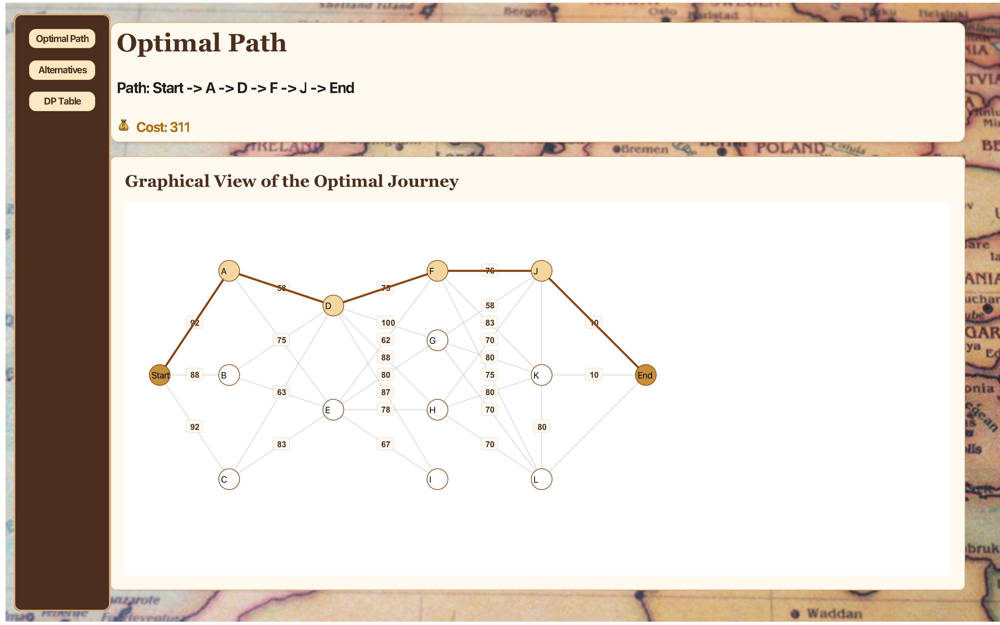
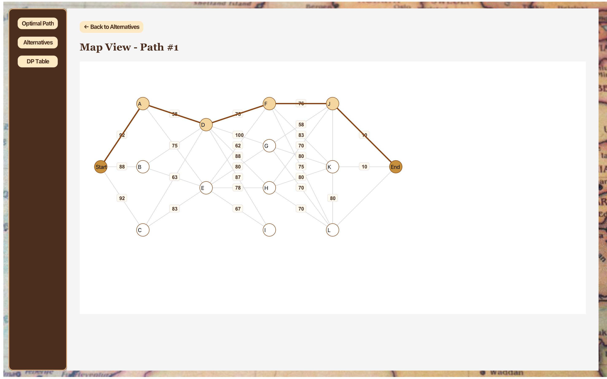
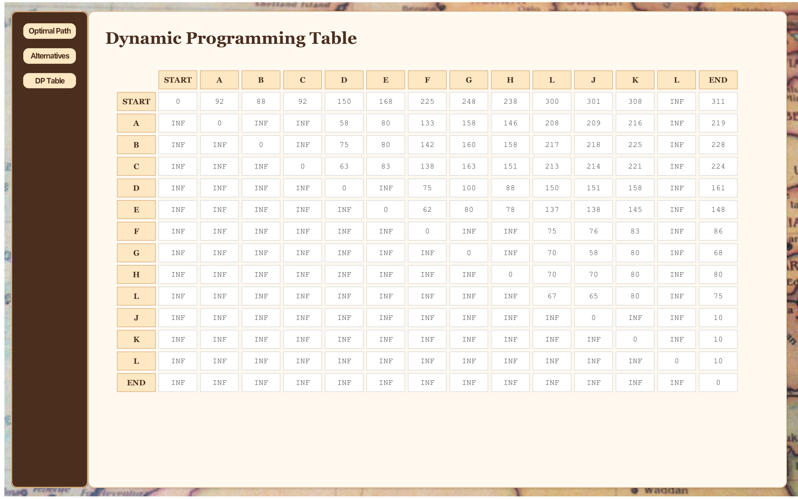

# 🚀 Optimal Travel Route Finder using Dynamic Programming

A project that determines the **minimum-cost travel route** between multiple cities using the **Dynamic Programming** approach (Floyd–Warshall Algorithm).  
The system efficiently calculates the **optimal and alternative paths** based on total travel cost, which includes petrol and hotel expenses.

This project elegantly visualizes algorithmic problem-solving — transforming complex path optimization into an interactive and intuitive experience.

---

## 🎯 Project Overview

This project solves the problem of finding the **minimum travel cost** from a starting city to a destination city.  
Each connection between cities has two types of costs:

- 🚗 **Petrol cost**  
- 🏨 **Hotel cost**  

The algorithm computes the **optimal route** that minimizes the total travel expense using **Dynamic Programming**,  
and also displays **alternative routes** as well as the **full DP cost table** in a clear, user-friendly format.

---

## ⚙️ Features

✅ Reads city data and connections from an input file  
✅ Calculates minimum travel cost using **Dynamic Programming (Floyd–Warshall Algorithm)**  
✅ Displays **optimal and alternative routes** ranked by cost  
✅ Visualizes the **travel network graph** interactively  
✅ Generates and shows the **DP cost table** in a well-styled format  
✅ Includes **animations, gradients, and shadows** for a modern UX  

---

## 🧠 Algorithm Explanation

The project uses the **Floyd–Warshall Algorithm**, a classic Dynamic Programming technique for finding the shortest paths between all pairs of nodes in a weighted graph.

### 🧩 Steps:
1. Represent all cities and connections in a cost matrix.  
2. Iteratively update the minimum costs using:  
   \[
   cost[i][j] = \min(cost[i][j],\ cost[i][k] + cost[k][j])
   \]
3. Use a path reconstruction matrix to retrieve the full optimal route.  

This approach ensures **O(N³)** time complexity and guarantees the globally minimal route.

---

## 🛠️ Technologies Used

- **Java** – Core logic and algorithm implementation  
- **Object-Oriented Design** – City, Connection, and TravelPath classes  
- **Dynamic Programming** – Optimal path cost computation  
- **Floyd–Warshall Algorithm** – Path optimization core  

---

## 📂 Project Structure

- **City.java** → Represents a city and its connections  
- **Connection.java** → Represents the cost between two cities  
- **TravelPath.java** → Represents a route and its total cost  
- **GraphVisualizer.java** → Visualizes the city network and paths  
- **Main.java** → Runs the app, applies DP, and manages UI logic  

---

## 🖼️ Screenshots

### 🏠 Welcome Screen

*Elegant entry screen inviting users to begin their journey.*

---

### 🗺️ Optimal Path Visualization

*Displays the most efficient travel route with highlighted connections and total cost.*

---

### 🧩 Alternative Paths

*Lists all alternative routes, ranked by cost, for better comparison.*

---

### 🧭 Path Graph View

*Visual representation of the travel network showing costs between cities.*

---

### 📊 Dynamic Programming Table

*Detailed cost matrix showing DP calculations for all city pairs.*

---

## 🚀 How to Run the Project

1. **Clone or download this repository:**
   - 💻 To clone using **Terminal or Git Bash**, run the following command:
     ```bash
     git clone https://github.com/AseelKhatib3/minimum-cost-dynamic-programming.git
     ```
   - 📦 Or click the green **"Code"** button above and choose **"Download ZIP"**.
2. Open the project in your preferred IDE (Eclipse / IntelliJ).
3. Make sure all resource images (e.g., plane.png, map.png, money.png, etc.) are placed in your resources folder.
4. Prepare your input.txt file with the following structure:
NumberOfCities
StartCity, EndCity
CityA, [CityB, PetrolCost, HotelCost], [CityC, PetrolCost, HotelCost]
5. Run the project via the Main class.
6. Enjoy the full route visualization ✈️🌍

---
## 🎬 Demo

🎥 Coming soon — a short video demo showcasing the algorithm and route visualization in action.
---
✨ Developed by Aseel Khatib
